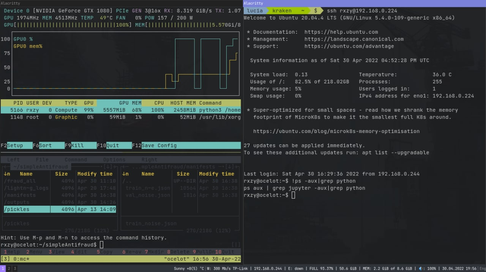

<h1 align="center">~$ dotfiles 🎎</h1>

Hello! This is mine collection of dotfiles. Usually I customize my system if I have a spare time. Currently I try to make a stable eye-candy and handy configuration for my ThinkPad x220T. This rice is under construction and I do not recommend to use it on your own.

Ongoing environment is:
- **Display manager** : SDDM 
- **Window manager** : i3wm
- **Terminal** : Alacritty
- **Console file manager** : Midnight Commander
- **Graphical file manager** : Nemo
- **GTK Theme** : Arc-Dark

This is how it looks like:

The most difficult part working with transformer notebook is a lack of touchscreen support. While using a GNU/Linux system I got there is not much features that helps to reveal this additional touching abilities. By example, I struggle to use libinput edge-scrolling to read manuals in the terminal. 

If you know a working configuration for this problem, please, let me know 💌.